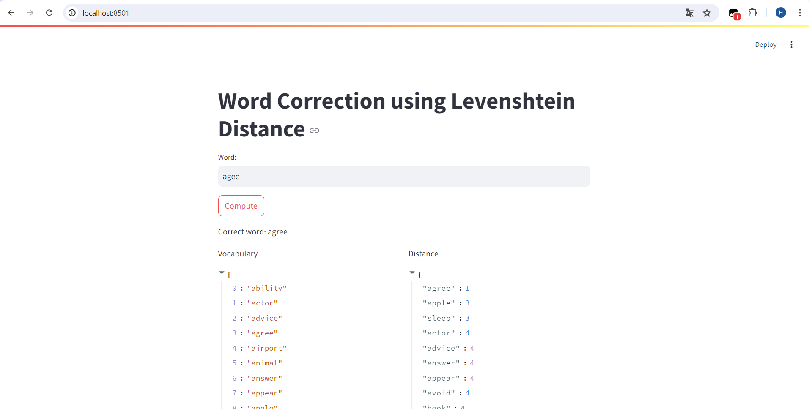
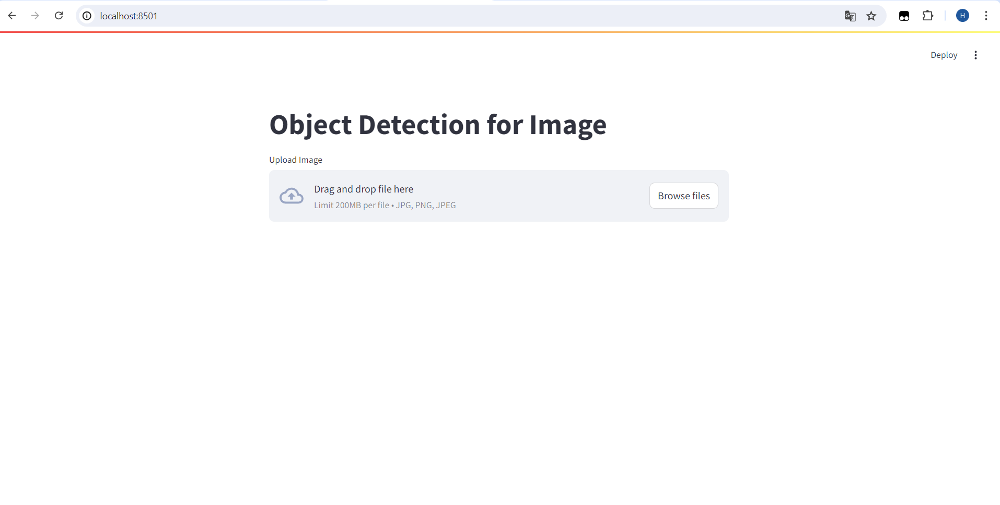
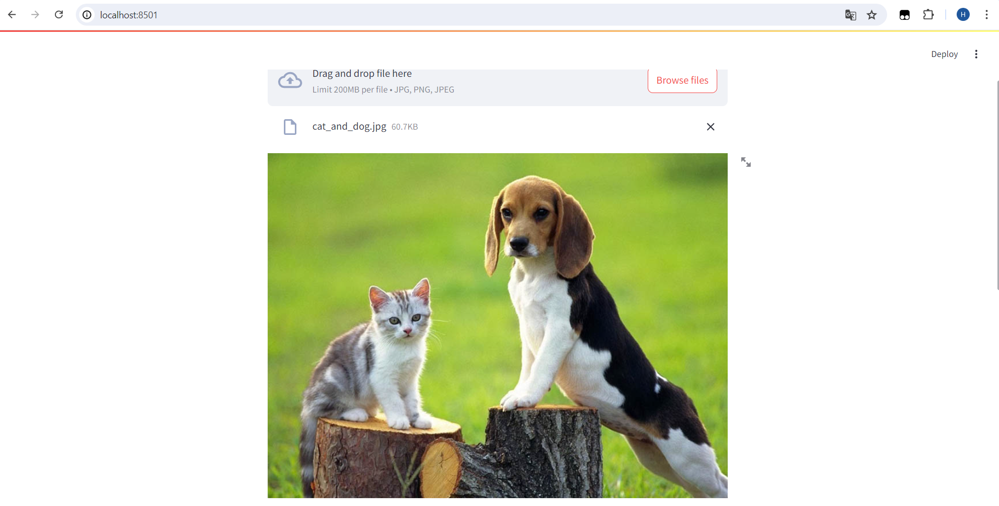
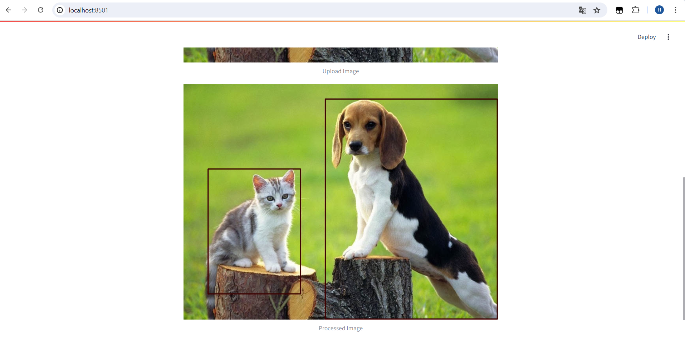
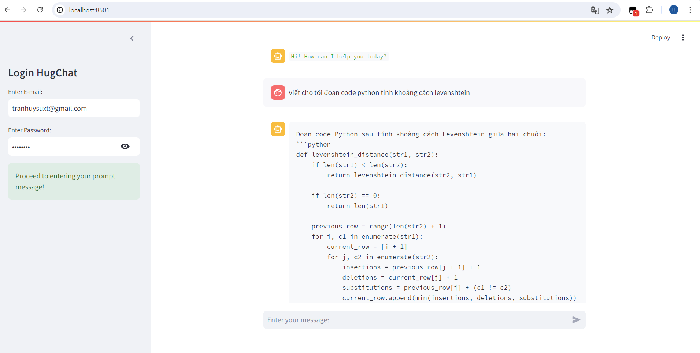

# Streamlit - Project
Project này gồm 3 phần chính khác nhau sử dụng thư viện Streamlit: Word-Correction, Object-Detection, Chatbot. Mỗi project cung cấp cho ta mỗi khía cạnh khác của AI bằng giao diện thân thiện và dễ sử dụng.
## Nội dung chính
1. [Giới thiệu](#Giới-thiệu)
2. [Cài đặt](#Cài-đặt)
3. [Word Correction](#word-correction)
4. [Object Detection](#object-detection)
5. [Chatbot](#chatbot)

## Giới thiệu
Các project sẽ tập trung vào việc sử dụng thư viện Streamlit trong Python để triển khai dự án. Đây là một thư viện mở của Python dễ dàng sử dụng và triển khai giao diện 1 cách thân thiện với người dùng.

- **Word Correction:** Ứng dụng gợi ý cách viết đúng cho các từ nhập vào bằng cách sử dụng khoảng cách Levenshtein.
- **Object Detection:** Ứng dụng nhận dạng đối tượng trong bức ảnh bằng mô hình neural network đã được huấn luyện sẵn.
- **Chatbot:** Ứng dụng tương tác với người dùng qua mô hình chatbot Hugging Face của HugChat.

## Cài đặt

Để cài đặt và chạy các ứng dụng này trên máy tính của bạn, hãy làm theo các bước sau:

1. Clone repository này về máy tính của bạn:
    ```bash
    git clone https://github.com/Huy-intern27/Streamlit_Project.git
    ```

2. Tạo môi trường ảo và cài đặt các thư viện cần thiết:
    ```bash
    python -m venv env
    source env/bin/activate  # Trên macOS và Linux
    env\Scripts\activate  # Trên Windows

    pip install -r requirements.txt
    ```

3. Chạy các ứng dụng sử dụng Streamlit:
    - Word Correction:
        ```bash
        cd Word_Correction
        streamlit run word_correction.py
        ```
    - Object Detection:
        ```bash
        cd Object_Detection
        streamlit run object_detection.py
        ```
    - Chatbot
    - :
        ```bash
        cd Chatbot
        streamlit run chatbot.py
        ```

## Word Correction

### Mô tả
Ứng dụng Sửa Lỗi Chính Tả sử dụng thuật toán khoảng cách Levenshtein để gợi ý cách viết đúng cho các từ mà người dùng nhập vào. Đây là một ứng dụng minh họa khả năng xử lý ngôn ngữ tự nhiên và sửa lỗi chính tả.

### Sử dụng
1. Chạy ứng dụng:
    ```bash
    cd Word_Correction
    streamlit run word_correction.py
    ```
2. Nhập từ cần kiểm tra vào ô nhập liệu và nhấn "Compute".
3. Ứng dụng sẽ hiển thị từ đã được sửa và khoảng cách Levenshtein cho từng từ trong từ điển.

### Demo
<p align='center'>
  
</p>

## Object Detection

### Mô tả
Ứng dụng Nhận Dạng Đối Tượng cho phép người dùng tải lên hình ảnh và nhận dạng các đối tượng trong hình ảnh đó bằng cách sử dụng mô hình mạng neural sâu đã được huấn luyện sẵn. Các đối tượng được nhận dạng sẽ được làm nổi bật trong hình ảnh.

### Sử dụng
1. Chạy ứng dụng:
    ```bash
    cd Object_Detection
    streamlit run object_detection.py
    ```
2. Tải lên tệp hình ảnh.
3. Ứng dụng sẽ hiển thị hình ảnh đã tải lên với các đối tượng được nhận dạng và làm nổi bật.

### Demo
<p align='center'>
  
</p>
<p align='center'>
  
</p>
<p align='center'>
  
</p>

## Chatbot

### Mô tả
Ứng dụng Chatbot cung cấp một giao diện trò chuyện tương tác cho người dùng. Nó sử dụng HugChat của Hugging Face để tạo ra các phản hồi dựa trên đầu vào của người dùng.

### Sử dụng
1. Chạy ứng dụng:
    ```bash
    cd Chatbot
    streamlit run chatbot.py
    ```
2. Nhập thông tin xác thực của Hugging Face.
3. Bắt đầu trò chuyện với bot.

### Demo
<p align='center'>
  
</p>

## Tác Giả

Project được phát triển bởi Huy-intern27.

## Liên Hệ

Nếu bạn có bất kỳ câu hỏi nào, vui lòng liên hệ qua [email](tranhuysuxt@gmail.com).